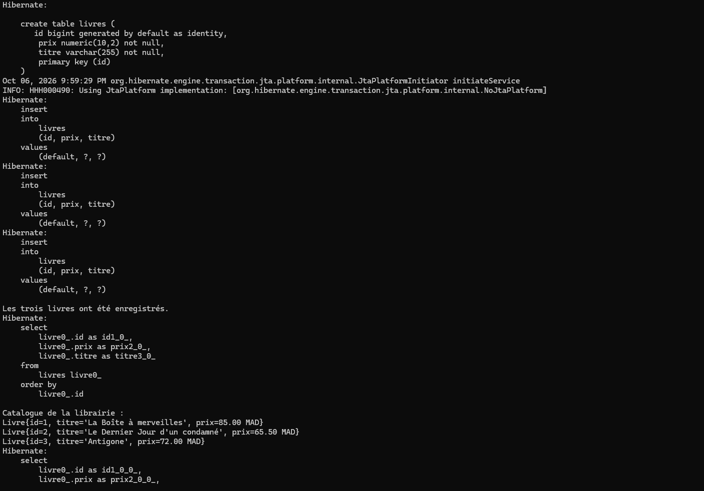
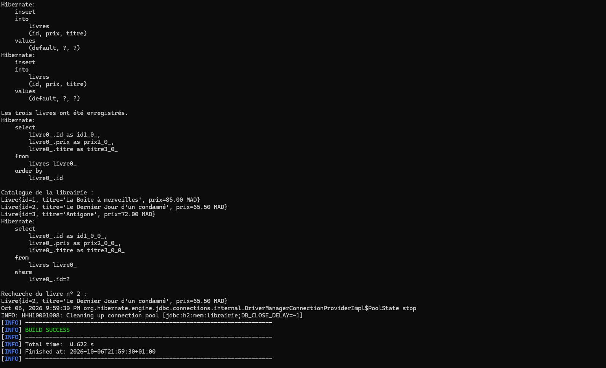
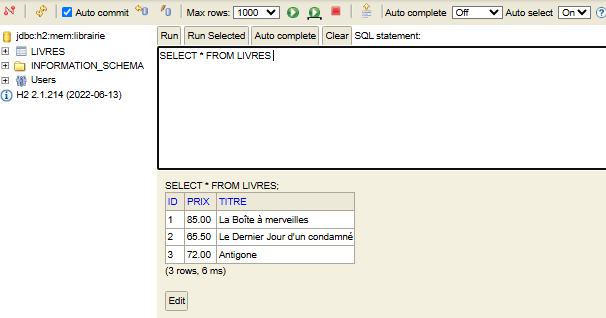

# Catalogue de librairie

## Captures d'exécution

Création de la table `LIVRES`, insertion des trois livres et affichage du catalogue :



Recherche du livre n° 2 et fin de l'exécution avec `BUILD SUCCESS` :



## Consulter la table dans H2

Depuis le dossier du projet :

```sh
mvn compile exec:java "-Dexec.args=--console"
```

Ouvrir [la console H2 sur le port 8082](http://localhost:8082) sur l'ordinateur où l'application est lancée. Le port reste fixé à **8082**.

| Paramètre | Valeur |
| --- | --- |
| Driver Class | `org.h2.Driver` |
| JDBC URL | `jdbc:h2:mem:librairie` |
| User Name | `sa` |
| Password | laisser vide |

Cliquer sur **Connect**, puis exécuter :

```sql
SELECT * FROM LIVRES ORDER BY ID;
```

Résultat de la requête `SELECT * FROM LIVRES;` dans la console H2, avec les trois livres enregistrés :



Garder l'application lancée pendant la consultation. Appuyer sur Entrée dans le terminal pour arrêter la console. La base est en mémoire : les données disparaissent à l'arrêt du processus Java.
